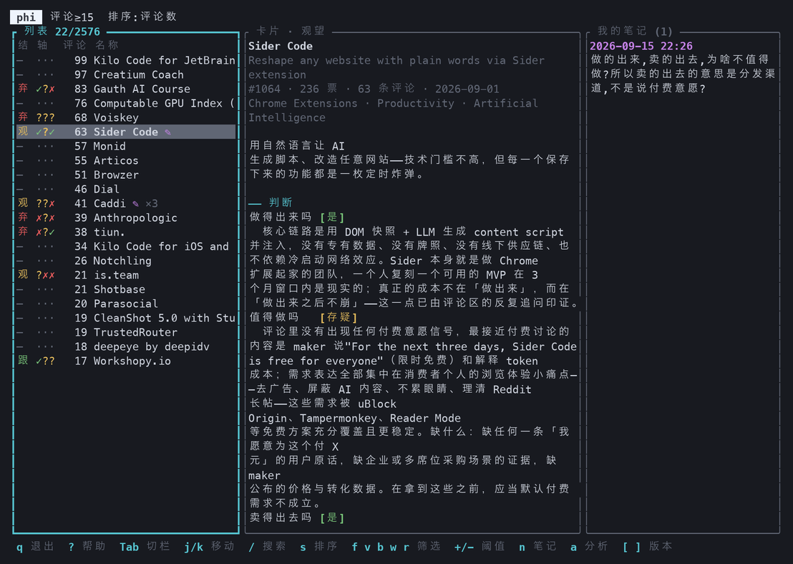
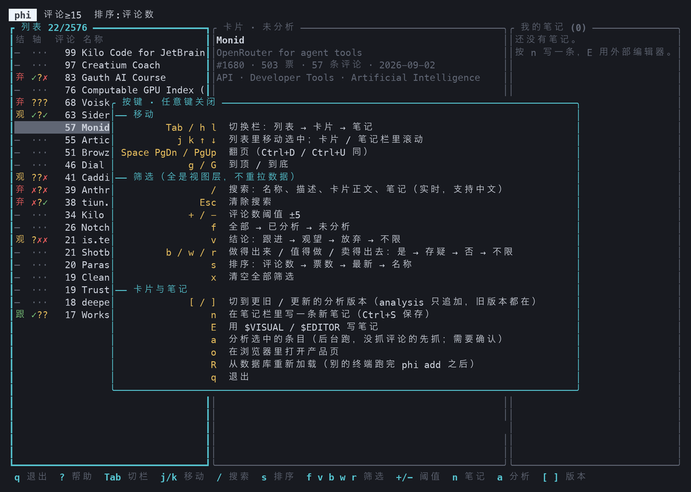

# phi

**ph**oduct**h**unt **i**nspiration tool —— 把 ProductHunt 上有真实用户讨论的产品，
拆成带证据的「机会卡片」，用来判断某个方向值不值得作为一人公司 / 小团队的产品切入点。



---

## 目标

不做产品介绍，只回答三个判断：

| 判断 | 问的是 |
|---|---|
| **做得出来吗** | 一个人或 2-3 人，3 个月内能不能做出来 |
| **值得做吗** | 有没有真实的付费需求 |
| **卖得出去吗** | 没预算没销售，能不能触达用户 |

每个判断取 `是 / 存疑 / 否`。`痛点`、`谁付钱`、`空位` 三栏**必须挂原文证据** ——
引不出证据的字段留空，不编。证据来自产品评论区，不是模型的先验。

采集刻意分两阶段（`sync` 拉轻量元数据、`hydrate` 只给候选拉评论），
因为 ProductHunt 的 API 配额是这个工具真正的瓶颈；模型成本一张卡约 0.2-0.3 美分，可以忽略。

---

## 编译与安装

需要 Rust **1.86+**（edition 2021）。没有其他系统依赖 —— TLS 走 rustls，
默认存储是 SQLite，不需要装数据库。

```bash
git clone https://github.com/bingo/phi.git
cd phi
cargo build --release
```

二进制在 `target/release/phi`。装到 `PATH` 里：

```bash
cargo install --path crates/cli
```

### 配置

两个 key，都从环境变量读，不进配置文件：

```bash
# Developer Token（不过期）：https://www.producthunt.com/v2/oauth/applications
export PH_TOKEN=...
export OPENROUTER_API_KEY=...
```

然后复制一份配置模板（`config.toml` 已在 `.gitignore` 里）：

```bash
cp config.example.toml config.toml
```

默认后端是 SQLite，开箱即用，数据库文件 `phi.db` 建在当前目录。
所有配置项都能用 `PHI_` 前缀的环境变量覆盖，双下划线表示层级，例如 `PHI_ANALYZER__MODEL=...`。
换 MySQL / MariaDB 见 [MANUAL.md](MANUAL.md#存储后端)。

---

## 命令行用法

单个产品跑通全流程：

```bash
phi add https://www.producthunt.com/posts/<slug>
```

批量采集是两步，中断后重跑会从游标续传：

```bash
phi sync --since 2026-09-01 --until 2026-09-14   # 阶段一：按天拉轻量元数据
phi hydrate --min-comments 15                    # 阶段二：只给够热度的候选拉评论
phi ls --min-comments 15 --pending               # 看看有哪些还没分析
phi analyze 1064                                 # 分析某一条
phi show 1064                                    # 打印最新卡片
```

### 全部命令

```
phi add <url>                主循环：抓取 → 评论 → 过滤 → 分析 → 打印卡片
phi sync --since <date>      阶段一：按天批量拉元数据
                             [--until <date>] [--max-pages N] [--refresh]
phi hydrate                  阶段二：给候选拉评论 [--min-comments N] [--limit N]
phi analyze <item_id>        分析一条已入库的 item
phi reanalyze <id> --diff    用存下的输入快照重跑，只有 model/prompt 在变
phi diff <a> <b>             并排对比两次分析
phi ls                       列出条目 [--min-comments N] [--limit N] [--pending]
phi show <item_id>           查看最新卡片
phi note <item_id> "..."     写笔记（不给正文则从 stdin 读）
phi search "<query>"         全文检索
phi filtered <item_id>       看评论过滤结果，抽查误杀率
phi dbsync [--reverse]       SQLite ↔ MySQL 搬数据，只增不改不删 [--dry-run]
phi schema                   打印发给模型的 JSON Schema
phi tui                      三栏浏览界面 [--min-comments N]
```

全局参数：`--config <path>`、`--model <name>`（覆盖配置里的模型，用来做归因）、`--log <level>`。

### TUI

```bash
phi tui --min-comments 15
```

左列表可筛可排，中间是卡片，右边是笔记。所有筛选都是视图层，不重新拉数据。
进去按 `?` 看全部按键：



---

## 文档

- [MANUAL.md](MANUAL.md) —— 完整使用说明：存储后端、两库之间搬数据、迁移失败的排查、代码布局、已知待验证点
- [DESIGN.md](DESIGN.md) —— 设计依据：为什么是这三个判断、为什么证据必须可追溯
- [TODO.md](TODO.md) —— 待办与待验证项

---

## License

MIT，见 [LICENSE](LICENSE)。
